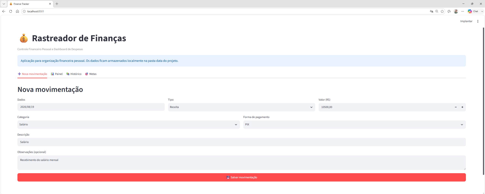
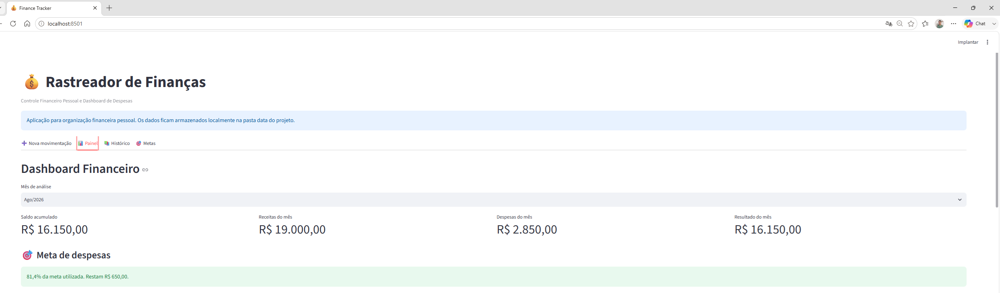
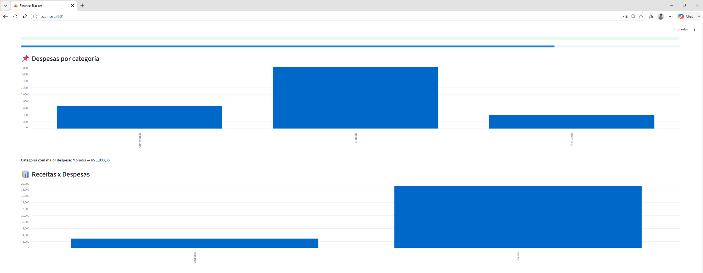
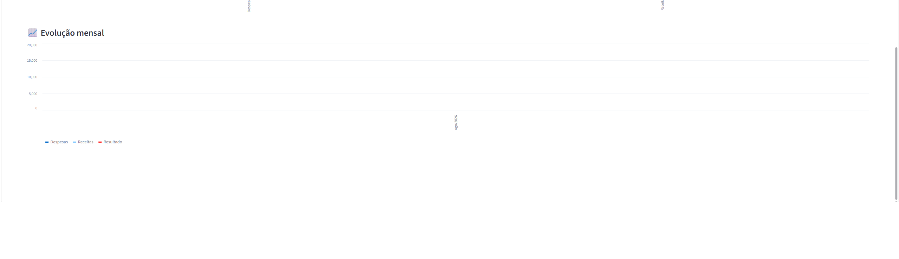
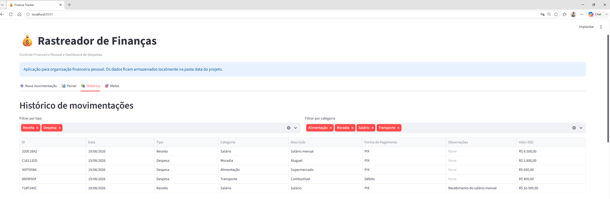
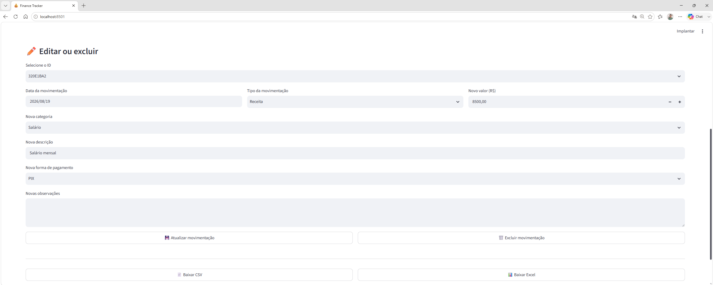
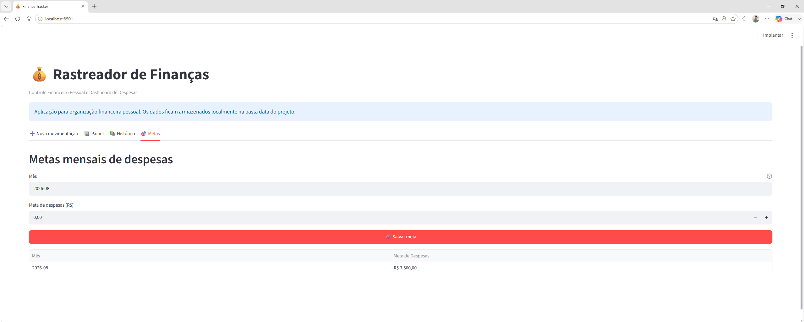

# 💰 Finance Tracker

### Controle Financeiro Pessoal e Dashboard de Despesas

Aplicação desenvolvida em **Python e Streamlit** para organização financeira pessoal, permitindo registrar receitas e despesas, acompanhar metas mensais e visualizar indicadores financeiros de forma simples e visual.

O projeto foi criado com foco em praticidade, organização dos dados e acompanhamento da evolução financeira ao longo do tempo.

---

## 🎯 Objetivo

O **Finance Tracker** permite centralizar movimentações financeiras pessoais em uma única aplicação.

Com ele é possível acompanhar:

- receitas;
- despesas;
- saldo acumulado;
- resultado mensal;
- despesas por categoria;
- metas mensais;
- evolução financeira;
- histórico de movimentações.

---

# 📸 Demonstração

## ➕ Nova movimentação

Cadastro de receitas e despesas com:

- data;
- tipo da movimentação;
- valor;
- categoria;
- forma de pagamento;
- descrição;
- observações.



---

## 📊 Dashboard Financeiro

O dashboard apresenta os principais indicadores financeiros do período:

- saldo acumulado;
- receitas do mês;
- despesas do mês;
- resultado mensal;
- percentual da meta utilizada.



---

## 📌 Despesas por categoria

O sistema consolida automaticamente as despesas registradas e apresenta a distribuição dos gastos por categoria.

Também identifica a categoria com maior impacto financeiro no mês selecionado.



---

## 📈 Evolução mensal

O Finance Tracker apresenta a evolução financeira mensal considerando:

- receitas;
- despesas;
- resultado financeiro.



---

## 📚 Histórico

Todas as movimentações ficam registradas em um histórico.

O usuário pode aplicar filtros por:

- tipo;
- categoria.



---

## ✏️ Edição de movimentações

Os registros existentes podem ser atualizados ou excluídos.

Na edição, o sistema mantém os dados anteriormente cadastrados, incluindo a forma de pagamento utilizada.



---

## 🎯 Metas mensais

É possível definir uma meta de despesas para cada mês.

O sistema compara automaticamente os gastos realizados com o limite definido e informa:

- percentual utilizado;
- valor ainda disponível;
- alerta quando a meta é ultrapassada.



---

# 💰 Indicadores financeiros

O dashboard calcula automaticamente:

```text
Saldo acumulado
Receitas do mês
Despesas do mês
Resultado do mês
Percentual da meta utilizada
Categoria com maior despesa
```

---

# 🎯 Controle de metas

O usuário pode cadastrar uma meta mensal de despesas.

Exemplo:

```text
Meta: R$ 3.500,00

Despesas: R$ 2.850,00

Utilização: 81,4%

Disponível: R$ 650,00
```

Quando as despesas permanecem dentro do limite, o sistema informa o valor restante.

Caso a meta seja ultrapassada, é exibido um alerta informando o valor excedido.

---

# 🗂️ Categorias

## Receitas

```text
Salário
Freelance
Investimentos
Venda
Reembolso
Outros
```

## Despesas

```text
Alimentação
Moradia
Transporte
Saúde
Educação
Lazer
Assinaturas
Compras
Impostos
Outros
```

---

# 💳 Formas de pagamento

O Finance Tracker permite registrar:

```text
PIX
Débito
Crédito
Dinheiro
Transferência
Boleto
Outro
```

---

# ✏️ Edição e exclusão

Cada movimentação recebe um identificador único.

No histórico, o usuário pode selecionar um registro para:

```text
Alterar data
Alterar tipo
Alterar valor
Alterar categoria
Alterar descrição
Alterar forma de pagamento
Alterar observações
Excluir movimentação
```

---

# 📤 Exportação

Os dados podem ser exportados em dois formatos.

## CSV

Arquivo contendo o histórico completo das movimentações financeiras.

## Excel

Arquivo `.xlsx` contendo as movimentações registradas para análises adicionais.

---

# 🔐 Privacidade

Os dados financeiros são armazenados localmente na pasta:

```text
data/
```

Os arquivos gerados pela aplicação não devem ser enviados para repositórios públicos.

O projeto utiliza `.gitignore` para impedir o versionamento de:

```text
data/*.csv
data/*.xlsx
```

Dessa forma, os dados financeiros utilizados localmente permanecem fora do repositório público.

---

# 🛠️ Tecnologias

- Python
- Streamlit
- Pandas
- OpenPyXL
- Git
- GitHub

---

# 📁 Estrutura do projeto

```text
Finance-Tracker/
│
├── app.py
├── README.md
├── requirements.txt
├── .gitignore
│
├── core/
│   ├── __init__.py
│   ├── finance.py
│   └── storage.py
│
├── data/
│   └── .gitkeep
│
└── assets/
    ├── 01-nova-movimentacao.png
    ├── 02-dashboard-resumo.png
    ├── 03-despesas-categoria.png
    ├── 04-evolucao-mensal.png
    ├── 05-historico.png
    ├── 06-edicao-movimentacao.png
    └── 07-metas.png
```

---

# ⚙️ Organização do código

## `app.py`

Responsável pela interface Streamlit e integração entre as funcionalidades da aplicação.

## `core/finance.py`

Responsável pelos cálculos financeiros:

```text
Saldo
Receitas
Despesas
Resultado mensal
Resumo por categoria
Resumo mensal
```

## `core/storage.py`

Responsável pelo armazenamento local das movimentações e das metas mensais.

---

# ▶️ Como executar

## 1. Clone o repositório

```bash
git clone https://github.com/JailtonDayvid38/Finance-Tracker.git
```

## 2. Entre na pasta

```bash
cd Finance-Tracker
```

## 3. Crie o ambiente virtual

```bash
py -m venv .venv
```

## 4. Instale as dependências

### Windows

```bash
.\.venv\Scripts\python.exe -m pip install -r requirements.txt
```

## 5. Execute a aplicação

```bash
.\.venv\Scripts\python.exe -m streamlit run app.py
```

A aplicação será aberta no navegador pelo Streamlit.

---

# 🗺️ Versão

## v0.1

Primeira versão funcional do **Finance Tracker**.

Principais funcionalidades:

- cadastro de receitas;
- cadastro de despesas;
- categorias;
- formas de pagamento;
- dashboard financeiro;
- saldo acumulado;
- análise mensal;
- despesas por categoria;
- evolução financeira;
- metas mensais;
- histórico;
- filtros;
- edição;
- exclusão;
- exportação CSV;
- exportação Excel.

---

# 🔮 Possíveis evoluções

Versões futuras poderão incluir:

- contas bancárias;
- cartões de crédito;
- despesas recorrentes;
- parcelamentos;
- orçamento por categoria;
- comparação entre meses;
- gráficos anuais;
- projeção de saldo;
- indicadores de economia;
- importação de extratos;
- dashboard anual.

---

# 👨‍💻 Autor

**Jailton Dayvid Silva de Morais**

Projeto desenvolvido como iniciativa prática de aplicação de:

**Python + Streamlit + Análise de Dados + Desenvolvimento de Sistemas**

---

# 📌 Status

**Versão atual: v0.1**

🟢 Projeto funcional.